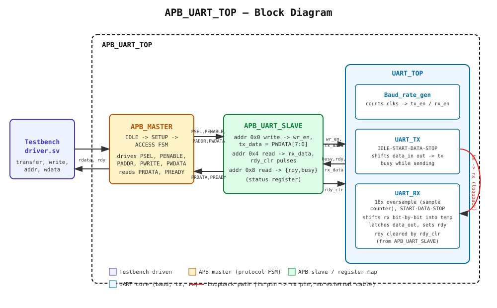
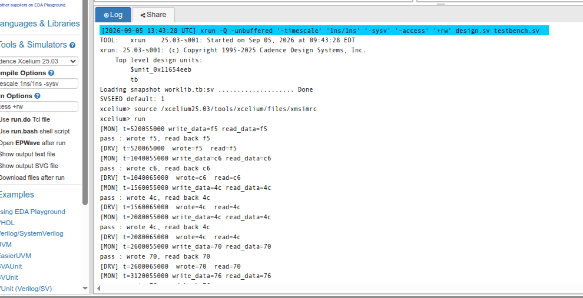

# APB-to-UART Bridge — RTL + SystemVerilog Verification

An APB slave peripheral that bridges the AMBA APB protocol to a UART transmitter/receiver, verified with a
class-based SystemVerilog testbench (generator → driver → monitor → scoreboard) built on virtual interfaces
and mailboxes. Developed and simulated on EDA Playground using Cadence Xcelium.

## Architecture



- **APB_MASTER** — a simple protocol FSM (`IDLE → SETUP → ACCESS`) that turns basic
  `transfer / write / addr / wdata` signals into a proper APB transaction (`PSEL`, `PENABLE`,
  `PADDR`, `PWRITE`, `PWDATA`).
- **APB_UART_SLAVE** — decodes the APB address into the register map below, and bridges data
  between the 32-bit APB bus and the 8-bit UART core.
- **UART_TOP** — `Baud_rate_gen` (clock-cycle counter → `tx_en` / `rx_en` strobes), `UART_TX`
  (parallel-to-serial, `IDLE→START→DATA→STOP`), and `UART_RX` (16x-oversampled serial-to-parallel).
  In this environment `tx` is looped straight back into `rx` — there's no physical UART on the
  other end, so a "receive" is really just this design hearing its own transmission.

### Register map (APB_UART_SLAVE)

| Address | Access | Meaning |
|---|---|---|
| `0x0` | Write | Byte to transmit. Triggers `wr_en` → `UART_TX` starts sending `PWDATA[7:0]`. |
| `0x4` | Read  | Last received byte (`rx_data`). Reading this address also clears `rdy` (`rdy_clr`). |
| `0x8` | Read  | Status: `{rdy, busy}` — `rdy` = a received byte is waiting, `busy` = transmitter active. |

## Repository structure

```
codes/
├── design/      # DUT RTL: design.sv, apb_master.sv, apb_uart_slave.sv,
│                #          uart_top.sv, baud_rate_gen.sv, uart_tx.sv, uart_rx.sv
└── testbench/   # Verification env: testbench.sv, interface.sv, trans.sv,
                 #   generator.sv, case1.sv, case2.sv, driver.sv, monitor.sv,
                 #   scoreboard.sv, env.sv, test.sv, package.sv, define.sv
outputs/
├── console_output.png          # Screenshot of the EDA Playground console (embedded in README below)
├── console_output.txt         # Full simulator console log, as plain text
└── architecture_diagram.svg   # Block diagram used above
LICENSE
README.md
```

## Verification environment

| File | Role |
|---|---|
| `interface.sv` | `intf` — virtual interface with `drv_cb`/`mon_cb` clocking blocks, plus an SVA assertion that `rdy` stays low while `PRESETn` is low |
| `trans.sv` | `trans` — randomized transaction: `wdata`, `PRESETn`, plus `rdata`/`rdy` filled in after the DUT responds |
| `generator.sv` | Base class for stimulus generators |
| `case1.sv` (`rst_check`) | Drives 10 transactions with `PRESETn == 0` — reset behavior |
| `case2.sv` (`write_read`) | Drives 10 randomized write-then-read-back transactions |
| `driver.sv` | Drives the APB write, waits for `rdy` (edge-safe — see note below), drives the APB read |
| `monitor.sv` | Passively watches the bus via `mon_cb`, edge-detects the write and the `rdy` falling edge, and reports the observed `{wdata, rdata}` pair |
| `scoreboard.sv` | Compares monitored write data against monitored read data, prints pass/fail |
| `env.sv` / `test.sv` | Wires the components together and selects which generator (`case1`/`case2`) runs |

### A real bug found during bring-up (worth knowing about)

Early runs showed intermittent read-data mismatches. Root cause: `wait(signal)` in SystemVerilog is
a **level check**, not an edge detector — it returns immediately if the condition is *already* true,
not only on a fresh transition. The driver's `wait(rdy)` could occasionally fire on a stale, not-yet-fully-cleared
`rdy` left over from the previous transaction, causing it to read back old data. Fixed by confirming a
low level first, then waiting for the transition:

```systemverilog
while (inf.drv_cb.rdy)  @(inf.drv_cb);   // drain any stale high
while (!inf.drv_cb.rdy) @(inf.drv_cb);   // wait for a confirmed low->high edge
```

The RTL itself was correct throughout — this was a testbench synchronization bug, not a design bug.

## How to run

Developed and run on [EDA Playground](https://edaplayground.com) with Cadence Xcelium:

```
xrun -Q -unbuffered -timescale 1ns/1ns -sysv -access +rw design.sv testbench.sv
```

Run `case2` (`write_read`, `env.sv` → `test_case = 1`) for the main functional check, and `case1`
(`rst_check`, `test_case = 0`) for the reset check.

## Results

Sample passing run (`case2`, 10/10 transactions):

```
[DRV] t=520065000  wrote=f5  read=f5
[DRV] t=1040065000  wrote=c6  read=c6
[DRV] t=1560065000  wrote=4c  read=4c
[DRV] t=2080065000  wrote=4c  read=4c
[DRV] t=2600065000  wrote=70  read=70
[DRV] t=3120065000  wrote=76  read=76
[DRV] t=3640065000  wrote=75  read=75
[DRV] t=4160065000  wrote=8f  read=8f
[DRV] t=4680065000  wrote=2b  read=2b
[DRV] t=5200065000  wrote=ac  read=ac
```

Full console output: [`outputs/console_output.txt`](outputs/console_output.txt)

## Console Output



## License

See [LICENSE](LICENSE).
